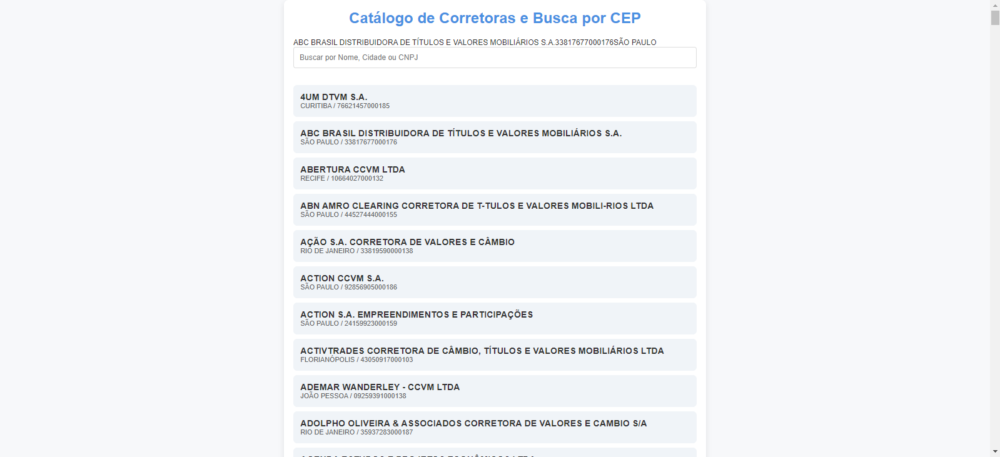
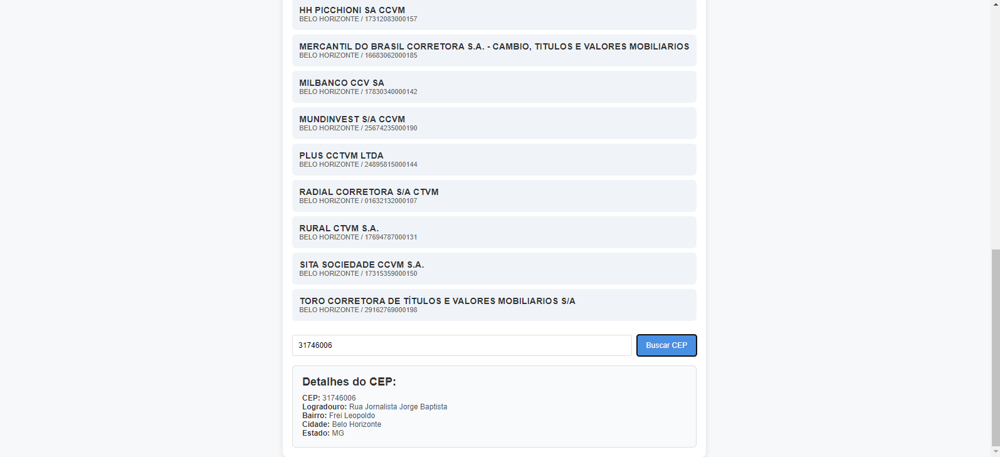
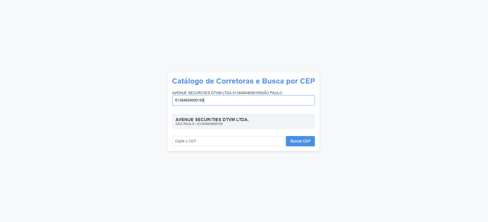
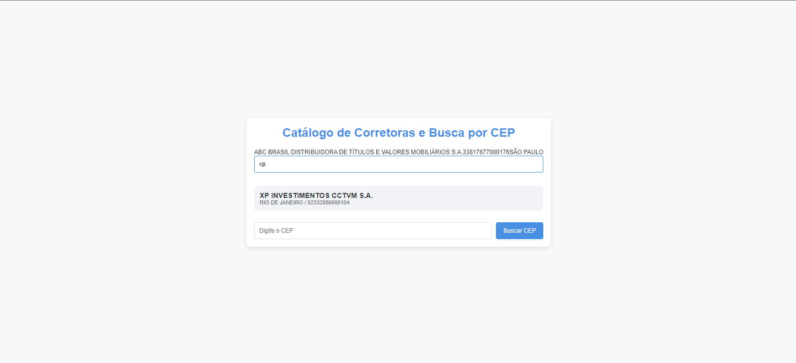
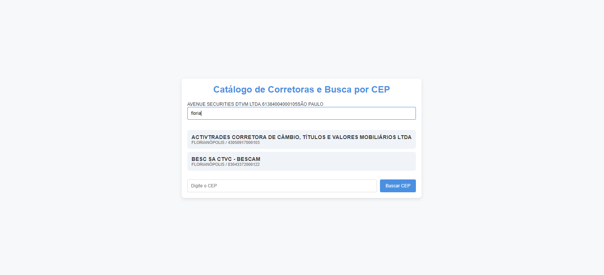
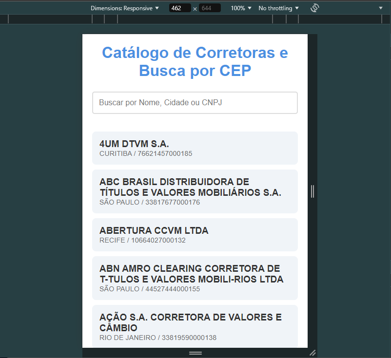
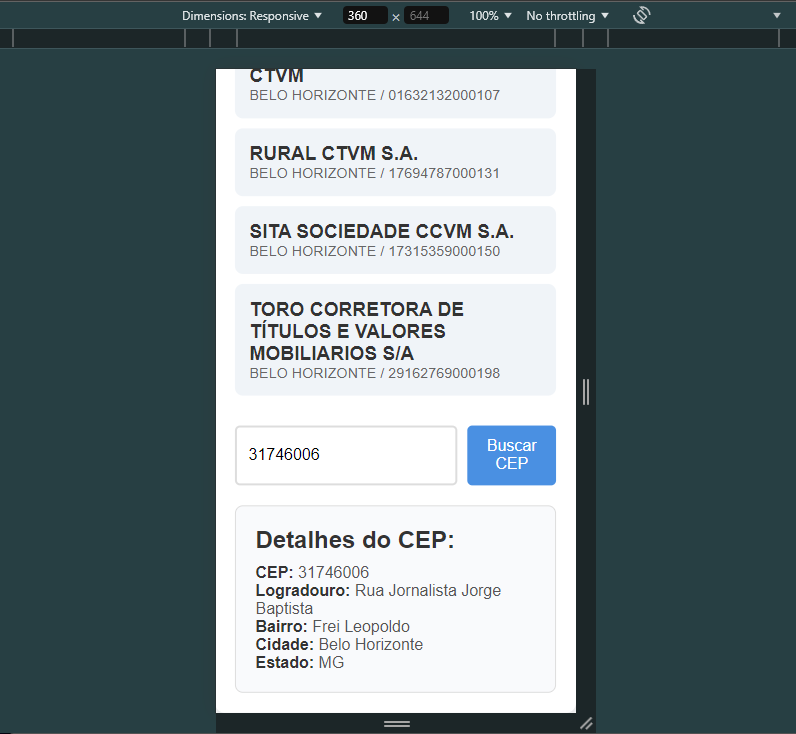
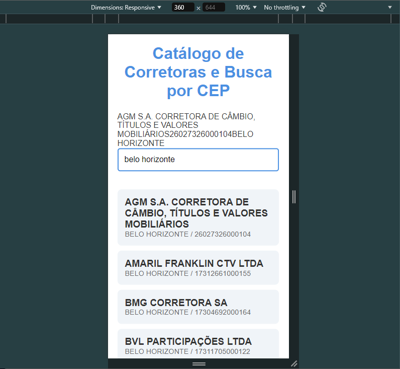
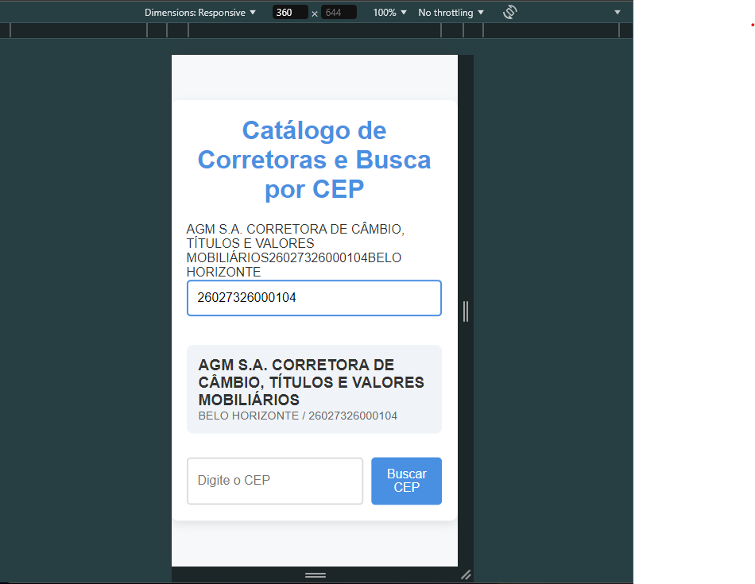

# Projeto de Listagem de Corretoras e Busca de CEP

Este projeto foi desenvolvido utilizando **Node-RED**, **React**, **JavaScript**, **HTML**, e **CSS**, com integração à **BrazilAPI**
para fornecer uma listagem de corretoras e busca de CEP. Ele permite ao usuário filtrar corretoras por nome, cidade e CNPJ, além de 
realizar buscas por CEP, fornecendo informações detalhadas.
  

# Tecnologias usadas para desenvolvimento

<div style="display: flex; flex-direction: column">


 
</div>

## Como inicializar o projeto

1. Clone este repositório:
 ```bash
   git clone https://github.com/AdrielLuniere/Desafio-buscando-cep.git
   ```
2. Instale as dependências:
    ```bash
   npm install
   ```
3. Inicie o projeto::
    ```bash
   npm start
   ```

# Funcionalidades
- Listagem de Corretoras: Exibe todas as corretoras disponíveis na BrazilAPI.
- Filtro por Nome, Cidade e CNPJ: Permite a busca e filtragem das corretoras.
- Busca por CEP: Mostra os detalhes de um CEP inserido na página.
    
# Screenshots - Desktop
<div style="display: flex; gap: 15px; flex-direction: column">





</div> 


# Screenshots - Mobile

<div style="display: flex; gap: 15px; flex-direction: column">





</div> 


<div style="display: inline_block">
  
<a href = "emailto:adrielbinda@gmail.com"></a>
<a href="https://www.linkedin.com/in/adriel-lunière-41b88716a/" target="_blank"></a>
<a href="https://adrielluniere.github.io/Portfolio-atualizado/" target="_blank"></a>
  
</div>

<h2>:bookmark_tabs: Desafios</h2>
<p>A maior dificuldade do projeto foi garantir que o filtro funcionasse corretamente para as corretoras. 
  Implementar uma busca eficiente que respondia de forma instantânea às mudanças na entrada de texto foi 
  um desafio, especialmente ao lidar com grandes volumes de dados de corretoras. Um dos maiores desafios 
  foi lidar com a busca em tempo real para as corretoras e o CEP, o que me ajudou a entender melhor o 
  ciclo de vida dos componentes no React e a manipulação de eventos assíncronos.</p>

## Aprendizado

Durante o desenvolvimento deste projeto, aprendi bastante sobre como integrar APIs externas, 
especificamente utilizando a BrazilAPI, e também como gerenciar estados no React de forma eficiente.
Além disso, consegui melhorar minhas habilidades em estilização com CSS para garantir uma interface 
mais profissional e responsiva. No geral, foi uma ótima experiência para consolidar meus conhecimentos em desenvolvimento web.

## Conclusão

Este projeto demonstra como integrar APIs externas, como a BrazilAPI, em uma aplicação web usando React e Node-RED. 
Ele proporciona uma experiência simples e eficiente para listar corretoras e realizar buscas por CEP, com uma interface 
amigável e responsiva. Embora existam desafios como latência e responsividade, o projeto serve como uma base sólida para 
futuras melhorias e expansões.


<h3>Ao clicar na imagem do figma, você será redirecionado a pagina onde foi criado o designer do portfolio</h3>
<p align="left"> <a href="https://www.figma.com/design/kgDwTbxNsDqwV5podb3jEp/Untitled?node-id=952-2&node-type=canvas&t=IuoyHfUbRple0PWd-0" target="_blank" rel="noreferrer">  </a> </p>

<h2>:hammer: Créditos</h2>
<table>
  <tr>
    <td align="center">
      <a href="https://github.com/AdrielLuniere">
        <br>
        <sub>
          <b>Adriel Lunière</b>
        </sub>
      </a>
    </td>
  </tr>
</table>

<h2>:dollar: Licença</h2>
<b>MIT License.</b>
